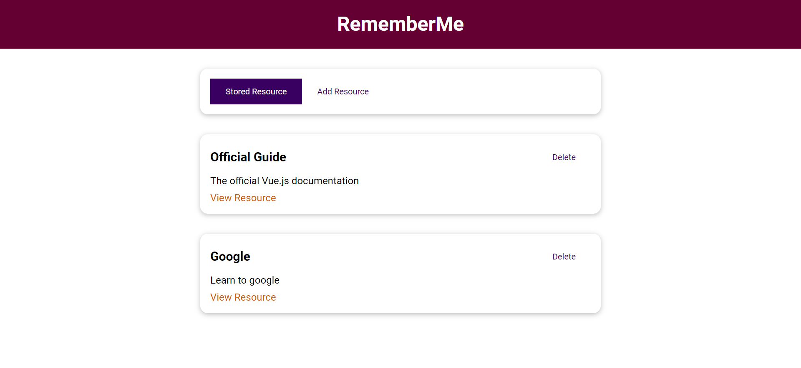
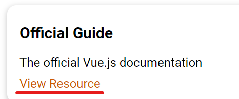
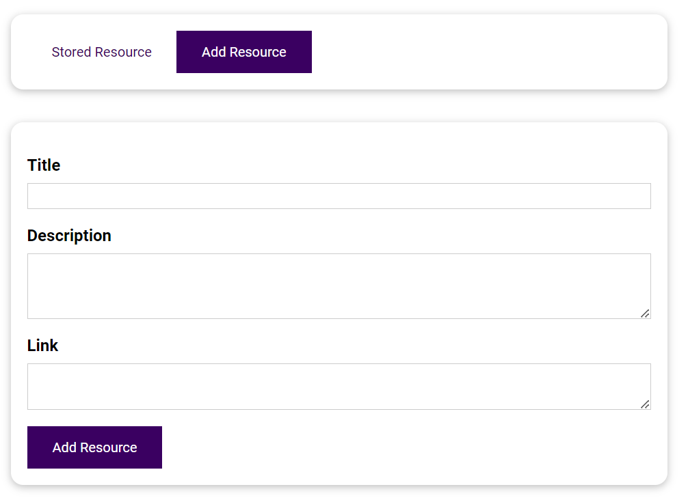
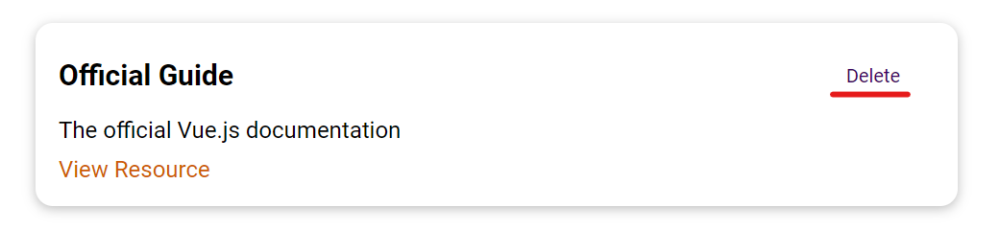
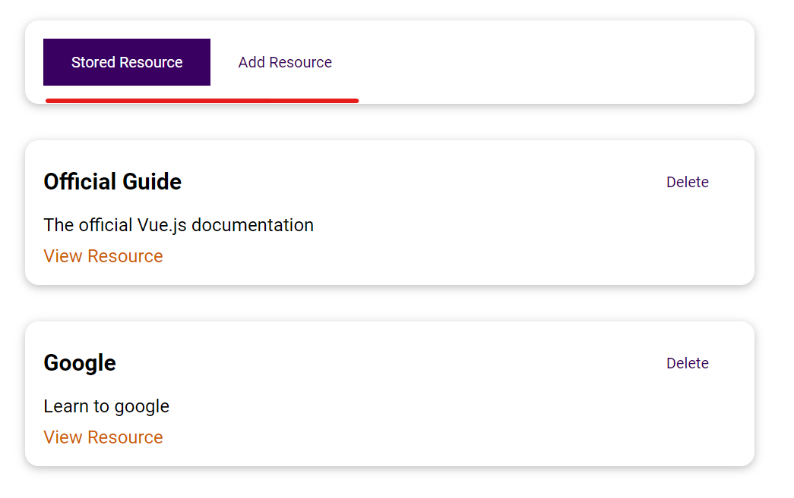

# The Learning Resources App
# About
Learning Resources App is a simple web application built using Vue js, HTML, CSS, and JavaScript.

It allows to share different learning resources to helps us to study.

# Features

## See the list of the created resources

## Read a selected resource

## Create a new resource

## Delete a selected resource

## Create a menu for switching views

# Tecnicals features
- Form submission
- Form validation
- Ref
- Provide/Inject data
- Use a dynamic component
- Set generals components
- Slots

# Project setup
npm install